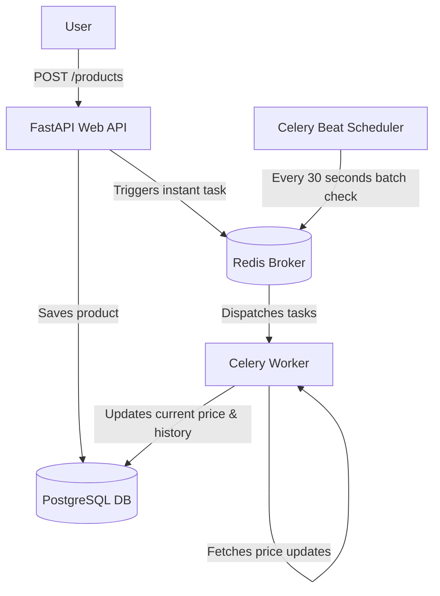

# Distributed Price Monitoring System

An asynchronous microservice application built with Python to track and monitor product price changes over time.

## 🛠️ Tech Stack
* **FastAPI** — Asynchronous Web API and interactive documentation.
* **PostgreSQL** — Relational database for storing products and price records.
* **SQLAlchemy 2.0 (Async)** — Modern async ORM for database communication.
* **Redis** — High-performance message broker and Celery backend.
* **Celery & Celery Beat** — Background task worker and scheduler for periodic price checks.
* **Docker & Docker Compose** — Full containerization and multi-container orchestration.

## 📐 Architecture Overview



## 📂 Project Structure

```text
price_monitor/
├── app/
│   ├── config.py         # Environment variables & configuration via Pydantic
│   ├── crud.py           # Database operations (Create/Read)
│   ├── database.py       # Async engine, session setup, and SQLAlchemy models
│   ├── main.py           # FastAPI application entry point & routing
│   ├── schemas.py        # Pydantic data validation schemas (DTOs)
│   └── worker.py         # Celery application & background tasks
├── .env.example          # Template for environment variables
├── .gitignore            # Git ignore configuration
├── Dockerfile            # Multi-stage-ready Python build instructions
├── docker-compose.yml    # Full system orchestration orchestrator
└── pyproject.toml        # Ruff linter configuration
```

## 🚀 Getting Started

### Prerequisites
Make sure you have **Docker** and **Docker Desktop** installed on your machine.

### Installation & Launch

1. Clone the repository and navigate to the project directory:
   ```bash
   cd price_monitor
   ```

2. Create a `.env` file from the example template:
   ```bash
   cp .env.example .env
   ```

3. Spin up the entire infrastructure using Docker Compose:
   ```bash
   docker compose up --build
   ```

Once all containers are up and running, the interactive API documentation (Swagger UI) will be automatically available at: **http://localhost:8000/docs**

## 🧪 API Features & Endpoints

* **`POST /products`** — Accepts a product URL, stores it in the database, and schedules an immediate background price parsing task.
* **`GET /products`** — Retrieves a full list of tracked products along with their dynamically updated background prices.
* **Automated Background Loops** — Celery Beat continuously iterates over all database records every 30 seconds to fetch and log up-to-date prices into the relational schema.
